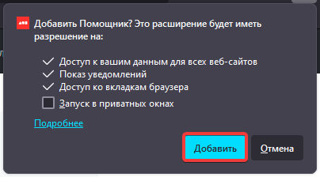

import { Tabs, TabItem, Card } from "@astrojs/starlight/components";

:::caution
Расширение работает корректно только с браузером Firefox. Официальной поддержки Chrome нет и не планируется.
:::

<Tabs>

<TabItem label="Автоматически" icon="setting">
<Card>

1.  Заходим на [главную страницу расширения](https://authfailed.github.io/domru-helper/)
2.  Нажимаем **Установить**
    
3.  Нажимаем **Продолжить установку**
    
4.  Нажимаем **Добавить**
    

</Card>
</TabItem>

<TabItem label="Вручную" icon="setting">
<Card>

1. Заходим на [страницу последнего релиза](https://github.com/AuthFailed/domru-helper/releases/latest)
2. Скачиваем из Assets файл `domhelper.xpi`
3. Открываем страницу `about:addons` в браузере
4. Нажимаем на шестеренку => Установить дополнение из файла
5. В появившемся окне нажимаем **Добавить**

</Card>
</TabItem>

</Tabs>
